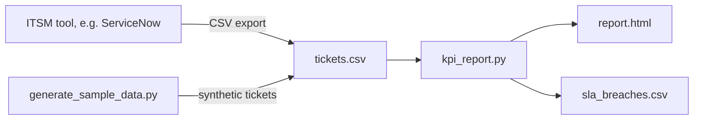

# ITSM Service Desk KPI Dashboard

A one-page KPI report for a service desk, built from a standard ticket export: volume, time to resolve, SLA compliance by priority and by team, the weekly trend, and the open tickets that are already past their target.

Built with Python (standard library only). Works with a CSV export from ServiceNow or any ITSM tool with similar columns, and includes a generator for **synthetic** tickets so you can try it straight away.

## The problem

Every service review asks the same questions: are we meeting our SLAs, which team is struggling, is the backlog growing, and what is about to breach? The data is in the ITSM tool, but pulling it into a slide every week is manual, and each person calculates it slightly differently.

This tool gives one consistent answer from one export:

- How many tickets did we handle, and how fast (median and mean time to resolve)?
- What share was resolved within the SLA target, per priority and per team?
- Is the backlog growing week by week?
- Which open tickets are already past their target and need a push today?

## What it produces

- **`report.html`**: a single-file report with KPI tiles, SLA compliance by priority and by team, the weekly trend (opened, resolved, net change, SLA) and the open tickets past target. Works offline and supports light and dark mode.
- **`sla_breaches.csv`**: the open tickets past their SLA target, sorted by priority and age, ready to share with team leads.

Default resolution targets (calendar hours), which you can change with `--sla`:

| Priority | Target |
|---|---|
| P1 Critical | 4 hours |
| P2 High | 8 hours |
| P3 Moderate | 24 hours |
| P4 Low | 72 hours |

## How it works



## Try it with sample data

Requires Python 3.10 or later. No extra packages needed.

```bash
git clone https://github.com/inigogonzalezgarcia/04-itsm-kpi-dashboard.git
cd 04-itsm-kpi-dashboard
python generate_sample_data.py
python kpi_report.py sample_data/tickets.csv
```

Open `output/report.html` in your browser.

Options:

```bash
python kpi_report.py tickets.csv --sla "1=2,2=8,3=40,4=120" --out-dir reports --title "Monthly service review"
```

## Use it with your own data

Export your incidents to CSV with these columns (the default field names in a ServiceNow incident list):

| Column | Example |
|---|---|
| `number` | INC0012345 |
| `opened_at` | 2026-09-28 09:15:00 |
| `resolved_at` | 2026-09-28 11:40:00 (empty if still open) |
| `priority` | 2 - High |
| `category` | Hardware |
| `assignment_group` | Service Desk |
| `state` | Resolved |

Then run `python kpi_report.py your_export.csv`. Timestamps without a time zone are treated as UTC. The export may contain internal ticket data, so keep it inside your organisation; CSV files and reports are excluded from Git by `.gitignore`.

## Tests

```bash
pip install pytest
python -m pytest
```

## Next steps

- Business hours and holiday calendars for SLA calculation, per site.
- First contact resolution and reopen rate.
- Month-over-month comparison for the service review pack.

## Background

Inspired by years of running service delivery for multi-site IT teams, where weekly service reviews, SLA reporting to management and shift planning depend on numbers everyone trusts. Built from scratch with synthetic data; no employer code or data is used.

## Customisation and contact

Need a version adapted to your environment (your own SLA rules and business hours, other ITSM tools, a scheduled report by email or Teams)? Get in touch:

- Email: [inigogonzalezgarcia@yahoo.es](mailto:inigogonzalezgarcia@yahoo.es)
- LinkedIn: [linkedin.com/in/igonzalez93](https://www.linkedin.com/in/igonzalez93)

## License

MIT
